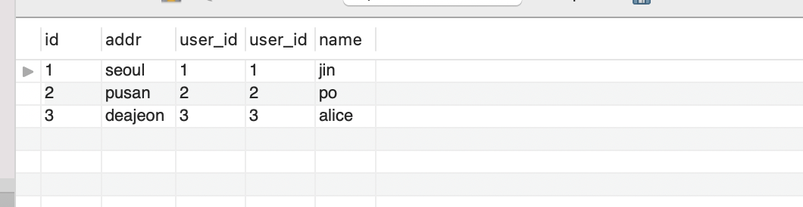

# SQL


- **Pandas**는 DF를 램에 저장한다. 램 영역에 저장해놓고, 가져와서 사용하는 것. 

  DB는 데이터를 Rom(하드)에 저장한다(훨씬 많은 데이터가 들어갈 수 있지).

  데이터 엄청 많을 때는, 사실 DB를 쓰는게 나음. 데이터가 500기가씩 되면 RAM에 어떻게 담을 거야. 

  데이터가 막 100TB면 이럴 때 spark같은 것을 쓰는 것. 컴퓨터에 1TB씩 100개에 나눠 저장하는 것. 

  그리고, 내 컴퓨터가 16기가라고 파이썬에서 16기가 다 쓸 수 있는 것도 아님. 이것도 따로 설정을 해야 함.

  경험상 똑같은 데이터면, DB가 더 빠르더라. 

  **참고로 파이썬은 gc가 700개가 모이면 쳐버리고 이렇게 함.**


- 테이블 생성시

  ```sql
  CREATE TABLE user1(
  	user_id INT PRIMARY KEY AUTO_INCREMENT,
  	name VARCHAR(20) NOT NULL,
  	email VARCHAR(30) UNIQUE NOT NULL,
  	age INT(3) DEFAULT '30',
  	rdate TIMESTAMP
  )
  ```

  - UNIQUE는 중복방지임. 그런데, 이렇게 하면 NULL이 하나는 들어올 수 있음. 그래서 보통, NOT NULL을 같이 써줌.

  - PRIMARY KEY는 그 자체에 UNIQUE와 NOT NULL이 동시에 들어간 상태이면서, PK를 지정한 것.  

  - **TIMESTAMP**는 데이터 안넣으면 현재 시간이 자동으로 들어가는 데이터타입. *연월일시분초* 그런데, 표준시로 되어 있을 것 보통. 서버시간이 보통 그렇게 되있음. 

  - 테이블 생성시의 인코딩은 데이터베이스의 인코딩을 따라간다. 라틴어로 되어 있네. 따로 변경을 하던가, DB자체의 인코딩을 설정해야 한다. 

    ```sql
    SHOW VARIABLES LIKE "character_set_database";
    ```

    utf 8로 바꾸려면

    ```sql
    ALTER DATABASE test CHARACTER SET = utf8;
    ```

    


- #### Data Import

  - #### Save Sample Data
    - https://dev.mysql.com/doc/index-other.html
    - world database zip 파일 다운로드
    - 압축 해제 후 world.sql 파일을 서버로 이동(CyberDuck)
    - database management app을 이용하여 world 데이터 베이스 생성
    - 데이터 저장 방법 1
    ```
    $ mysql -u root -p world < world.sql
    ```
    - 데이터 저장 방법 2
    ```
    sql> create database world;
    sql> use world;
    sql> source world.sql
    ```

  - Sakila DB

    - Sakila Data의 경우는 data와 schema를 두개 다 가지고 있음. 별개 파일. 

      schema(테이블 만들고 셋팅하는 쿼리)를 먼저 임포트 하고, 그 다음에 다시 data(데이터 넣는 쿼리)를 가지고 와야 에러가 안남.

    - *sakila database download*
       \- https://dev.mysql.com/doc/index-other.html

    - *Import sakila database*
      ` $ mysql -u root -p`
      ` sql> create database sakila; `

      `sql> quit`

    - `$ mysql -u root -p sakila < sakila-schema.sql`

    - ` $ mysql -u root -p sakila < sakila-data.sql`


- #### JOIN

  - 원래 테이블 모양,
  -  **user**

  

  - **addr table**

    

  - **JOIN**
	
    총 20개 들어가게 된다.  그냥 이렇게만 하면, 아무 기준도 없고 아무것도 없음. 모든 조합 다 들어가게 됨. 
  
    ```sql
    SELECT *
    FROM add	r 
    JOIN user;
    ```
  
    
  
  - **JOIN ON** 기준을 준다. *두 ON 기준으로 교집합만 남는다.*
  
    ```sql
    SELECT *
    FROM addr 
    JOIN user
    ON addr.user_id = user.user_id;
    ```
  
     
  
    당연하지만, 원하는 컬럼만 선택 가능. 
  
    ```sql
    SELECT addr.addr, addr.user_id, user.name
    FROM addr 
    JOIN user
    ON addr.user_id = user.user_id;
    ```
  
  - **LEFT JOIN==LEFT OUTER JOIN** 왼쪽이 기준 
  
    ```sql
    SELECT id, addr.addr, user.name
    FROM addr
    LEFT JOIN user
    ON addr.user_id = user.user_id;
    ```
  
    
  
    보통은 이럴 때, IFNULL을 사용 
  
    ```sql
    SELECT id, addr.addr, addr.user_id, IFNULL(user.name, "NO VALUES")
    FROM addr
    LEFT OUTER JOIN user
    ON addr.user_id = user.user_id;
    ```
  
  - **RIGHT OUTER JOIN == RIGHT JOIN**
  
    ```sql
    SELECT id, addr.addr, user.user_id, IFNULL(user.name, "NO VALUES")
    FROM addr
    RIGHT OUTER JOIN user
    ON addr.user_id = user.user_id;
    ```
  
    
  
  - OUTER JOIN(MYSQL에 없음. UNION으로 만들어 내는 것)
  
    **UNION : SELECT문의 결과를 합쳐서 출력**
  
    자동으로 중복을 제거해줌. 
  
    ```sql
    SELECT name
    FROM user
    UNION
    SELECT addr
    FROM addr;
    ```
  
    
  
    ```sql
    SELECT *
    FROM user
    UNION
    SELECT *
    FROM addr;
    ```
  
    컬럼이 다른 것끼리 합쳐버리면 아래처럼 에러남. 컬럼이 같은 애들끼리, 합칠 수 있음.
  
    **UNION이 쓸만한게, 그냥 스스로 한 테이블 내에서도 있던 중복이 사라짐.** 
  
    `Error Code: 1222. The used SELECT statements have a different number of columns`
  
    중복 제거를 안하고 싶으면, 
  
    **UNION ALL**
  
    ```sql
    # UNION ALL: 중복 제거 X
    SELECT name
    FROM user
    UNION ALL
    SELECT addr
    FROM addr;
    ```
  
  - **OUTER JOIN**
  
    MYSQL에서 OUTER JOIN을 어떻게쓰냐면, 
  
    A를 가지고 LEFT OUTER JOIN한 다음에, B가지고 똑같이 RIGHT OUTER JOIN 
  
    그리고 두개를 합침. 
  
    그럼 중간에 겹치는거는 UNION 하면서 사라질거 아녀. 
  
    ```sql
    SELECT user.name, addr.addr 
    FROM user
    LEFT JOIN addr 
    ON user.user_id = addr.user_id;
    ```
  
    
  
    ```sql
    SELECT user.name, addr.addr 
    FROM user
    RIGHT JOIN addr 
    ON user.user_id = addr.user_id;
    ```
  
    
  
    이 둘을 합치면
  
    ```sql
    (SELECT user.name, addr.addr 
    FROM user
    LEFT JOIN addr 
    ON user.user_id = addr.user_id)
    UNION
    (SELECT user.name, addr.addr 
    FROM user
    RIGHT JOIN addr 
    ON user.user_id = addr.user_id);
    ```
  
    