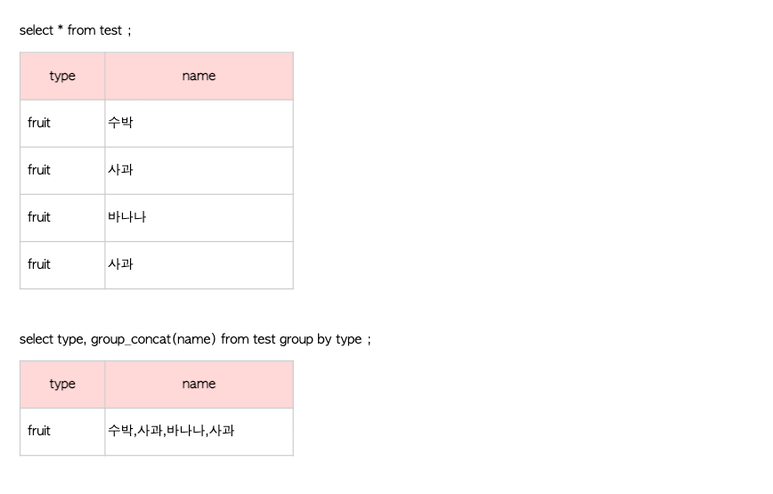

# SQL

- 로컬에서 mysql 접근시 

  `mysql -u root -p  -h localhost`

  

- **Pandas**는 DF를 램에 저장한다. 램 영역에 저장해놓고, 가져와서 사용하는 것. 

  DB는 데이터를 Rom(하드)에 저장한다(훨씬 많은 데이터가 들어갈 수 있지).

  데이터 엄청 많을 때는, 사실 DB를 쓰는게 나음. 데이터가 500기가씩 되면 RAM에 어떻게 담을 거야. 

  데이터가 막 100TB면 이럴 때 spark같은 것을 쓰는 것. 컴퓨터에 1TB씩 100개에 나눠 저장하는 것. 

  그리고, 내 컴퓨터가 16기가라고 파이썬에서 16기가 다 쓸 수 있는 것도 아님. 이것도 따로 설정을 해야 함.

  경험상 똑같은 데이터면, DB가 더 빠르더라. 

  **참고로 파이썬은 gc가 700개가 모이면 쳐버리고 이렇게 함.**


- 테이블 생성시

  ```sql
  CREATE TABLE user1(
  	user_id INT PRIMARY KEY AUTO_INCREMENT,
  	name VARCHAR(20) NOT NULL,
  	email VARCHAR(30) UNIQUE NOT NULL,
  	age INT(3) DEFAULT '30',
  	rdate TIMESTAMP
  )
  ```

  - UNIQUE는 중복방지임. 그런데, 이렇게 하면 NULL이 하나는 들어올 수 있음. 그래서 보통, NOT NULL을 같이 써줌.

  - PRIMARY KEY는 그 자체에 UNIQUE와 NOT NULL이 동시에 들어간 상태이면서, PK를 지정한 것.  

  - **TIMESTAMP**는 데이터 안넣으면 현재 시간이 자동으로 들어가는 데이터타입. *연월일시분초* 그런데, 표준시로 되어 있을 것 보통. 서버시간이 보통 그렇게 되있음. 

  - 테이블 생성시의 인코딩은 데이터베이스의 인코딩을 따라간다. 라틴어로 되어 있네. 따로 변경을 하던가, DB자체의 인코딩을 설정해야 한다. 

    ```sql
    SHOW VARIABLES LIKE "character_set_database";
    ```

    utf 8로 바꾸려면

    ```sql
    ALTER DATABASE test CHARACTER SET = utf8;
    ```

    


- #### Data Import

  - #### Save Sample Data
    - https://dev.mysql.com/doc/index-other.html
    - world database zip 파일 다운로드
    - 압축 해제 후 world.sql 파일을 서버로 이동(CyberDuck)
    - database management app을 이용하여 world 데이터 베이스 생성
    - 데이터 저장 방법 1
    ```
    $ mysql -u root -p world < world.sql
    ```
    - 데이터 저장 방법 2
    ```
    sql> create database world;
    sql> use world;
    sql> source world.sql
    ```

  - Sakila DB

    - Sakila Data의 경우는 data와 schema를 두개 다 가지고 있음. 별개 파일. 

      schema(테이블 만들고 셋팅하는 쿼리)를 먼저 임포트 하고, 그 다음에 다시 data(데이터 넣는 쿼리)를 가지고 와야 에러가 안남.

    - *sakila database download*
       \- https://dev.mysql.com/doc/index-other.html

    - *Import sakila database*
      ` $ mysql -u root -p`
      ` sql> create database sakila; `

      `sql> quit`

    - `$ mysql -u root -p sakila < sakila-schema.sql`

    - ` $ mysql -u root -p sakila < sakila-data.sql`


- #### JOIN

  - 원래 테이블 모양,
  -  **user**

  

  - **addr table**

    

  - **JOIN**
	
    총 20개 들어가게 된다.  그냥 이렇게만 하면, 아무 기준도 없고 아무것도 없음. 모든 조합 다 들어가게 됨. 
  
    ```sql
    SELECT *
    FROM add	r 
    JOIN user;
    ```
  
    
  
  - **JOIN ON** 기준을 준다. *두 ON 기준으로 교집합만 남는다.*
  
    ```sql
    SELECT *
    FROM addr 
    JOIN user
    ON addr.user_id = user.user_id;
    ```
  
     
  
    당연하지만, 원하는 컬럼만 선택 가능. 
  
    ```sql
    SELECT addr.addr, addr.user_id, user.name
    FROM addr 
    JOIN user
    ON addr.user_id = user.user_id;
    ```
  
  - **LEFT JOIN==LEFT OUTER JOIN** 왼쪽이 기준 
  
    ```sql
    SELECT id, addr.addr, user.name
    FROM addr
    LEFT JOIN user
    ON addr.user_id = user.user_id;
    ```
  
    
  
    보통은 이럴 때, IFNULL을 사용 
  
    ```sql
    SELECT id, addr.addr, addr.user_id, IFNULL(user.name, "NO VALUES")
    FROM addr
    LEFT OUTER JOIN user
    ON addr.user_id = user.user_id;
    ```
  
  - **RIGHT OUTER JOIN == RIGHT JOIN**
  
    ```sql
    SELECT id, addr.addr, user.user_id, IFNULL(user.name, "NO VALUES")
    FROM addr
    RIGHT OUTER JOIN user
    ON addr.user_id = user.user_id;
    ```
  
    
  
  - OUTER JOIN(MYSQL에 없음. UNION으로 만들어 내는 것)
  
    **UNION : SELECT문의 결과를 합쳐서 출력**
  
    자동으로 중복을 제거해줌. 
  
    ```sql
    SELECT name
    FROM user
    UNION
    SELECT addr
    FROM addr;
    ```
  
    
  
    ```sql
    SELECT *
    FROM user
    UNION
    SELECT *
    FROM addr;
    ```
  
    컬럼이 다른 것끼리 합쳐버리면 아래처럼 에러남. 컬럼이 같은 애들끼리, 합칠 수 있음.
  
    **UNION이 쓸만한게, 그냥 스스로 한 테이블 내에서도 있던 중복이 사라짐.** 
  
    `Error Code: 1222. The used SELECT statements have a different number of columns`
  
    중복 제거를 안하고 싶으면, 
  
    **UNION ALL**
  
    ```sql
    # UNION ALL: 중복 제거 X
    SELECT name
    FROM user
    UNION ALL
    SELECT addr
    FROM addr;
    ```
  
  - **OUTER JOIN**
  
    MYSQL에서 OUTER JOIN을 어떻게쓰냐면, 
  
    A를 가지고 LEFT OUTER JOIN한 다음에, B가지고 똑같이 RIGHT OUTER JOIN 
  
    그리고 두개를 합침. 
  
    그럼 중간에 겹치는거는 UNION 하면서 사라질거 아녀. 
  
    ```sql
    SELECT user.name, addr.addr 
    FROM user
    LEFT JOIN addr 
    ON user.user_id = addr.user_id;
    ```
  
    
  
    ```sql
    SELECT user.name, addr.addr 
    FROM user
    RIGHT JOIN addr 
    ON user.user_id = addr.user_id;
    ```
  
    
  
    이 둘을 합치면
  
    ```sql
    (SELECT user.name, addr.addr 
    FROM user
    LEFT JOIN addr 
    ON user.user_id = addr.user_id)
    UNION
    (SELECT user.name, addr.addr 
    FROM user
    RIGHT JOIN addr 
    ON user.user_id = addr.user_id);
    ```
  
    


- #### Subquery

  

- FULL TEXT 검색

  https://stricky.tistory.com/435

  FULL TEXT SEARCH


- ##### GROUP_CONCAT

  [GROUP_CONCAT 사용법](https://fruitdev.tistory.com/16)

  

- ### INDEX

  [INDEX](https://velog.io/@gillog/SQL-Index%EC%9D%B8%EB%8D%B1%EC%8A%A4)

  [INDEX2](https://mangkyu.tistory.com/96)

  explain을 쳐보면, 실행 계획을 볼 수 있다. 

  type ALL -> 전체 다 찾겠다. 

  possible_key -> 인덱스로 사용할 키가 없다. 사용할 수 있는 키를 의미하므로 여러개일 수 있다. 

  key는 위의 Possible중 어떤 키를 사용했는지를 의미. 

  Extra -> index사용 안하고, 위에서 부터 쭉 where을 사용했다는 것. 

  

  인덱스 지정 방법은 간단함. 

  ```sql
  CREATE INDEX tdate 
  ON salaries (to_date)
  
  # tdate라는 인덱스 이름으로, Salaries테이블의 to_date컬럼을 목차로 만들겠다. 
  ```

  

  아래 보이는, Cardinality 6339는 목차를 6339개로 나눴다는 뜻. 

  

  

  ```sql
  DROP INDEX tdate ON salaries;
  ```

  인덱스 삭제 방법. 

  인덱스를 사용한다는 것은, 어떤 저장공간안에 이 인덱스가 저장된다는 뜻. 저장공간을 훨씬 더 많이 사용하게 됨. 

  **그리고, 데이터 추가될때마다 인덱스 업데이트 해줘야함(SQL SERVER가 알아서 해주는 것).** 

  인덱스가 너무 많으면 Insert가 느려진다. 

  주로 where절에 자주 사용되는 컬럼을 인덱스로 지정한다. 

- #### 색인 생활코딩 자료

  1. 인덱스 추가로 생성

     `  **CREATE INDEX <인덱스명> ON <테이블명> ( 칼럼명1, 칼럼명2, ... );**`

     `CREATE INDEX idx_test ON books ( writer );`

  2. 테이블 생성시 인덱스 생성

     ` **INDEX <인덱스명> ( 칼럼명1, 칼럼명2 )** `

     `**UNIQUE INDEX <인덱스명> ( 칼럼명 )  --> 항상 유일해야 함.** `

     ```sql
     CREATE TABLE `books` (
            `id` varchar(5) NOT NULL,
            `name` varchar(20) NOT NULL,
            `writer` varchar(20) NOT NULL,
            `price` decimal(10,2) DEFAULT '0.00',
            `genre` varchar(20) NOT NULL,
            `publisher` varchar(20) NOT NULL,
            `discount_yn` char(1) NOT NULL,
            `discount_rate` decimal(10,0) DEFAULT '0',
            `cnt` decimal(10,0) DEFAULT '0',
            `sale_date` datetime DEFAULT NULL,
            PRIMARY KEY (`id`),
            INDEX `idx_test` (`writer`)
          );
     
     ```

     

  3. 테이블에 추가 

      **ALTER TABLE <테이블명> ADD INDEX <인덱스명> ( 칼럼명1, 칼럼명2, ... );**

     `ALTER TABLE books ADD INDEX idx_test ( writer );`

  4. 인덱스 보기 

      **SHOW INDEX FROM <테이블명>;**

     `SHOW INDEX FROM books;`

  5. 인덱스 삭제 

     **ALTER TABLE <테이블명> DROP INDEX <인덱스명>;**

     ` ALTER TABLE books DROP INDEX idx_test;`

     

  **인덱스의 종류**

  - primary: 중복되지 않는 유일한 키
  - normal : 중복을 허용하는 인덱스
  - unique : 중복을 허용하지 않는 유일한 키
  - foreign : 다른 테이블과의 관계성을 부여하는 키
  - full text : 자연어 검색, myisam에서만 지원

  미리 잘 정리정돈 해뒀다가, 사용자가 원하는 정보를 바로 꺼내주는 것. 

  아무것도 안하면 뭐든지 검색할 때 Full Scan을 하는 것. 

  ```sql
  DROP TABLE IF EXISTS `student`;
  CREATE TABLE `student` (
    `id` tinyint(4) NOT NULL AUTO_INCREMENT,
    `name` char(4) NOT NULL,
    `address` varchar(50) NOT NULL,
    `department` enum('국문과','영문과','컴퓨터공학과','전자공학과','물리학과') NOT NULL,
    `introduction` text NOT NULL,
    `number` char(255) NOT NULL,
    PRIMARY KEY (`id`),
    UNIQUE KEY `idx_number` (`number`) USING BTREE,
    KEY `idx_department` (`department`),
    
    # 중복키
    KEY `idx_department_name` (`department`,`address`),
    FULLTEXT KEY `idx_introduction` (`introduction`)
  ) ENGINE=MyISAM AUTO_INCREMENT=9 DEFAULT CHARSET=utf8;
   
  INSERT INTO `student` VALUES (1, '이숙경', '청주', '컴퓨터공학과', '저는 컴퓨터 공학과에 다닙니다. computer', '0212031');
  INSERT INTO `student` VALUES (2, '박재숙', '서울', '영문과', '저는 영문과에 다닙니다.', '0512321');
  INSERT INTO `student` VALUES (3, '백태호', '경주', '컴퓨터공학과', '저는 컴퓨터 공학과에 다니고 경주에서 왔습니다.', '0913134');
  INSERT INTO `student` VALUES (4, '김경훈', '제천', '국문과', '제천이 고향이고 국문과에 다닙니다.', '9813413');
  INSERT INTO `student` VALUES (6, '김경진', '제주', '국문과', '이번에 국문과에 입학한 김경진이라고 합니다. 제주에서 왔어요.', '0534543');
  INSERT INTO `student` VALUES (7, '박경호', '제주', '국문과', '박경호입니다. 잘 부탁드립니다.', '0134511');
  INSERT INTO `student` VALUES (8, '김정인', '대전', '영문과', '김정인입니다. 대전에서 왔고, 영문과에 다닙니다.', '0034543');
  
  ```

  

  **primary key**

  - 테이블 전체를 통틀어서 중복되지 않는 값을 지정해야 한다.
  - where 문을 이용해서 데이터를 조회할 때 가장 고속으로 데이터를 가져올 수 있다.
  - 테이블마다 딱 하나의 primary key를 가질 수 있다.

  ```Sql
  select` `* ``from` `student ``where` `id=3;
  ```

  **unique key**

  - 테이블 전체를 통틀어서 중복되지 않는 값을 지정해야 한다. (== primary key)
  - 고속으로 데이터를 가져올 수 있다.
  - 여러개의 unique key를 지정할 수 있다.

  ```sql
  select` `* ``from` `student ``where` `number=0534543;
  ```

  **normal key(그냥 Key라고 선언된 부분)**

  - 중복을 허용한다.
  - primary, unique 보다 속도가 느리다.
  - 여러개의 키를 지정할 수 있다.

  ```Sql
  select` `* ``from` `student ``where` `department=``'국문과'
  ```

  **Full Text**

  - mysql의 기본설정(ft_min_word_len)이 4로 되어 있기 때문에 최소 4글자 이상을 입력하거나 이 값을 조정해야 한다.
  - mysql은 전문 검색 엔진이 아니기 때문에 한글 검색이 잘 안된다.
    전문검색엔진으로 [lucene](http://lucene.apache.org/core/), [sphinx](http://sphinxsearch.com/) 참고
  - 스토리지 엔진 중 myisam에서만 사용가능

  ```Sql
  SELECT` `introduction, MATCH(introduction) AGAINST(``'영문과에'``) ``FROM` `student ``WHERE` `MATCH (introduction) AGAINST(``'영문과에'``);
  ```

  **중복키(인덱스중 하나가 아니라, 인덱스를 정의하는 방법 중 하나)**

  - 하나의 키에 여러개의 칼럼을 포함
  - 학과/주소 검색을 같이 일어나는 경우가 자주 일어나는 경우에는 이렇게 하나의 키로 묶는 경우 빠름. 

  ```Sql
  select` `* ``from` `student ``where` `department=``'국문과'` `AND` `address=``'제주'``;
  ```

  **인덱스의 정의 방법**

  - 자주 조회되는 칼럼에 적용
  - 조회 시 오랜시간을 소모하는 컬럼에 적용
  - 데이터가 긴 경우 인덱스를 사용하지 않는다.

   


- #### View

  ```sql
  USE world;
  CREATE VIEW code_name AS
  SELECT code, name FROM country;
  
  SELECT * FROM city
  JOIN code_name
  ON city.countrycode = code_name.code;
  
  ```


