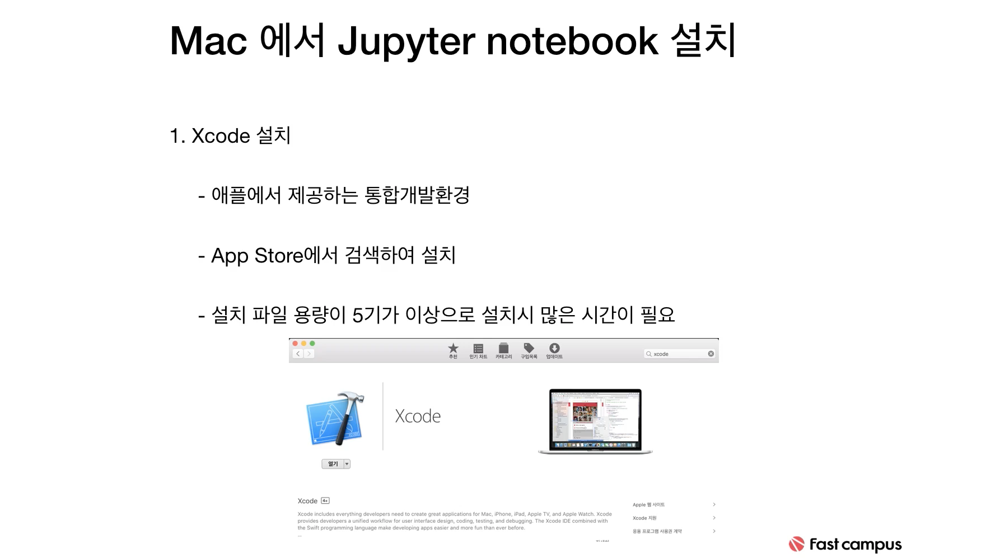
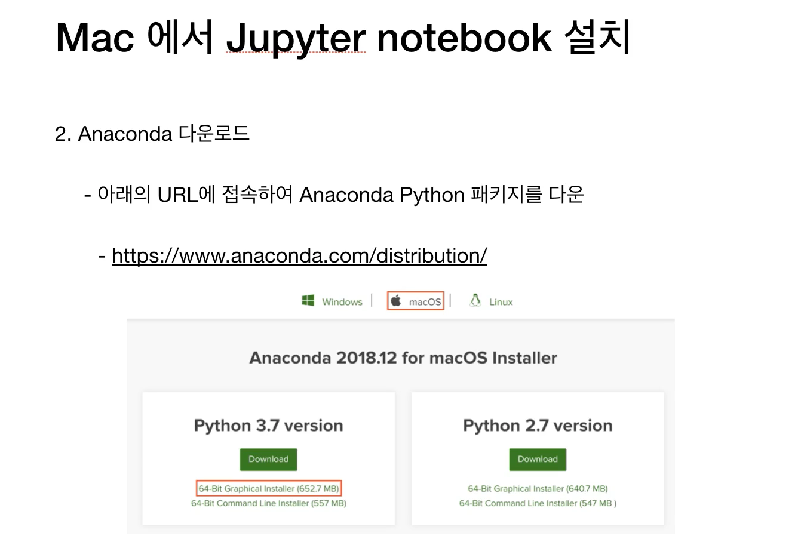

# Week1

- #### 주피터노트북 설치

  일단 App Store에서 xcode를 설치해야 한다. 

  

  아나콘다 설치 

  

- #### 주피터 노트북 실행 환경에 대한 설명

  - 아나콘다는 파이썬 패키지들이 포함되어 있는 **파이썬**이다. 파이썬을 그냥 설치하면 깡통이니깐, 옵션의 차를 설치해 주는 것. 

  

  - 파이썬 안에 Ipython이 들어 있음. Interactive Python. 

  - Jupyter Notebook = Ipython + a. 웹 브라우져를 이용해서 코드를 작성할 수 있게 해주는 프로그램. 

    

- #### 컴퓨터 개요

  CPU는 계산을 해주는 주체. +, - 등의 연산을 한다. 

  RAM 메모리- 임시저장소. 1+2에서 1과 2를 어딘가에서 저장하는 것. 그것을 가지고 가서 CPU에서 저장을 하는 것. 

  ROM은 파일 형태로 저장되어 있는 것. 엑셀 파일은 롬에 저장되어 있음. 이제, 그것을 더블클릭 하면 그 내용들이 RAM으로 옮겨지는 것. 그 실행하는데 걸리는 시간이 ROM에 있는 데이터를 RAM으로 옮기는데 시간이 걸리는 것이야. 그리고 나서 그 셀에 저장되어 있는 애들을 계산하는 것은 CPU. 저장하기 누르면, RAM에 저장되어 있던 애들이 ROM으로 간다. 

  

  

  

  운영체제의 핵심이 되는 **커널**라는 것은 **하드웨어를 컨트롤하는** **소프트웨어**이다. CPU, ROM, RAM같은 하드웨어를 사용하려면 누군가 계속 이 자원 할당에 대해서 판단해야 함. 그게 바로 운영체제. 

  우리가 코드를 작성하면, 어떠한 운영체제 위에서 작성하는 것. 그러므로, 똑같은 코드를 작성해도, 이 운영체제가 무엇이냐에 따라 자원의 사용은 달라진다. 

  Application(프로그램)은 운영체제 위에서 작동되는 것. 

  막 이것저것 띄우면 컴퓨터가 느려지는 이유가, 램을 다 쓰면, 롬의 가상메모리라는 것을 사용함. 롬은 애초에 느리기 때문에 컴퓨터가 느려지는 것. 

  

  **운영체제란?**

  운영체제는 컴퓨터 시스템의 자원들을 효율적으로 관리하며, 사용자가 컴퓨터를 편리하고, 효과적으로 사용할 수 있도록 환경을 제공하는 **여러 프로그램의 모임**입니다. 운영체제는 컴퓨터 사용자와 컴퓨터 하드웨어 간의 인터페이스로서 동작하는 시스템 소프트웨어의 일종으로, 다른 응용프로그램이 유용한 작업을 할 수 있도록 환경을 제공해 줍니다.

  **커널이란?**

  컴퓨터와 전원을 켜면 운영체제는 이와 동시에 수행된다. 한편 소프트웨어가 컴퓨터 시스템에서 수행되기 위해서는 메모리에 그 프로그램이 올라가 있어야 한다. 마찬가지로 운영체제 자체도 소프트웨어로서 전원이 켜짐과 동시에 메모리에 올라가야 한다. 하지만, 운영체제처럼 규모가 큰 프로그램이 모두 메모리에 올라간다면 한정된 메모리 공간의 낭비가 심할것이다. 따라서 운영체제 중 **항상 필요한 부분**만을 전원이 켜짐과 동시에 메모리에 올려놓고 그렇지 않은 부분은 필요할 때 메모리에 올려서 사용하게 된다. 이 때 **메모리에 상주하는 운영체제의 부분을 커널**이라 한다. 또 이것을 좁은 의미의 운영체제라고도 한다. ***즉 커널은 메모리에 상주하는 부분으로써 운영체제의 핵심적인 부분을 뜻한다.*** 이에 반에 넓은 의미의 운영체제는 커널뿐 아니라 각종 시스템을 위한 유틸리티들을 광범위하게 포함하는 개념이다. (보통은 운영체제라고 하면 커널을 말하게 된다.)

  운영체제라고 하면  커널+드라이브+기타등등을 의미한다. 

  커널에서 하는 메모리 관리, 프로세스 스케쥴링 등이 핵심적인 부분이라서 메모리에 상주하게 되고, 드라이브(마우스/키보드 등 하드웨어랑 연결해 주는것) 그런애들은 필요할때 불러오게 됨. 고로, 커널이라고 하면 운영체제의 핵심코드를 의미하며, 보통 **운영체제=커널**을 의미한다. 

  

  전류가 흐르면 1, 안 흐르면 0. 

  컴파일러는, 코드를 쭉다 작성을 하면, 얘네들을 한번에 컴파일링을 하고 그것을 파일로 저장. 그리고, 컴퓨터에서 번역된 파일을 실행하는 것. 번역본을 읽게 하니깐 속도는 빠르겠지만, 번역하는 시간이 필요함. 

  인터프리터는, 한줄씩 번역하면서 실행하는 것. 

  

  

  우리가 생각하는 파이썬은 **CPython**. 우리가 파이썬 코드를 짜면 그것은 인터프리터 언어인데, 다른사람의 패키지나 모듈 가져다 쓰면 그것은 C언어등의 컴파일러언어로 되어 있음. 속도가 빠름. 그래서 파이썬이 좋은 것. 

- #### 프로그래밍을 한다는 것은?

  

  ​	

- #### 주피터 환경설정

  파이썬과 아나콘다는 무엇일까?

  파이썬을 설치하면  Numpy, Pandas, Scikit-Learn 이런 패키지들을 각각 따로 설치해 줘야 함. 

  그러나, 아나콘다를 사용하면 위에 것들이 묶여서 다 들어있다고 생각하면 됨. 

  장단점이라고 하면, 아나콘다는 당연히 좀 무거울 수 밖에 없지. 

  Windows에서 명령프롬프트 or gitbash에서 실행하는데. 명령프롬프트에서 쓰는 shell과 gitbash에서 쓰는 shell이 다른 것. bash환경 맞추려고 윈도우에서도 gitbash설치하라고 한 것. **맥은 기본이 bash쉘.** 

  주피터노트북이라는걸 실행하면 하나의 서버가 실행되는 것. 주소는 **Localhost 8888**처럼 실행시키면 하단에 나옴. 

  그리고 파이썬이 있고, ipython이 있다. 이것은 기본 파이썬에서 부족한 기능들을 추가한 파이썬이라고 생각하면 된다. 기본적으로는 ipython으로 주피터노트북이 동작이 된다. 

  

- #### 주피터 노트북 생성 및 기본 사용 방법

  go to jupyter notebook 

