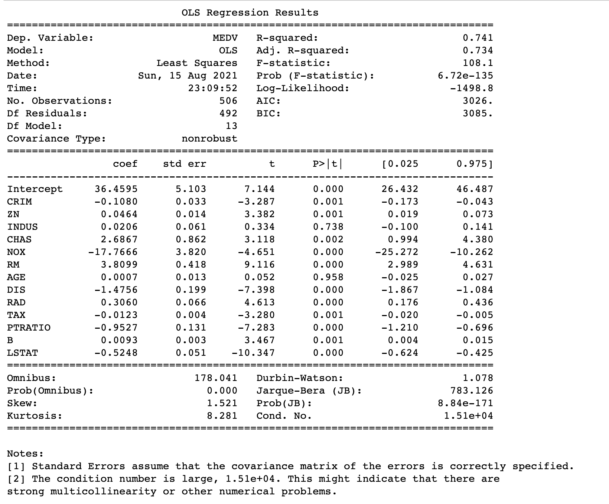

# Linear Regression 해석

| Name                    | Description                                                  |
| ----------------------- | ------------------------------------------------------------ |
| Dep. Variable:  MEDV    | 종속변수                                                     |
| Model: OLS              | OLS방법론으로 시행                                           |
| Method: Least Squares   | OLS중에서도 Least Square라는 방법을 썻다.                    |
| No. Observations:   506 | 데이터의 갯수                                                |
| Df Residuals:  492      | 쓴 변수의 갯수 + 상수항 더하면 14개. 그 14개를 데이터갯수에서 빼준 값이 ***잔차의 자유도*** |
| Df Model:  13           | 쓴 변수의 갯수                                               |
|                         |                                                              |
|                         |                                                              |
|                         |                                                              |
|                         |                                                              |
|                         |                                                              |
|                         |                                                              |

